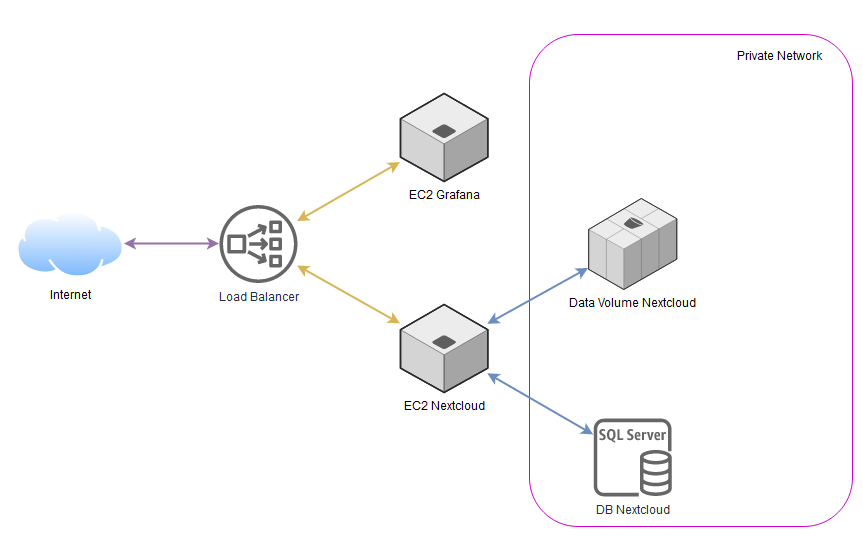

# Cloud-TP3



L'objectif de ce TP est de déployer une infrastructure nextcloud supervisé avec grafana et prometheus.

Installation et execution des scripts:

```bash
git clone https://github.com/HDCarBoNe/Cloud-TP3.git
cd Cloud-TP3
terraform init
terraform apply --auto-approve
```

Le script terraform permet le déployement sur le provider scaleway:
- [x] 2 adresses IP publique
- [x] Un réseau privée
- [x] Un volume pour les données de Nextcloud
- [x] Une instance Grafana
- [x] Une instance Nextcloud
- [x] Une base de données
- [ ] Un load balancer
- [x] Associé le volume Nextcloud à l'instance
- [ ] Monter une infrastructure de haute disponibilité dans une autre zone

Des scripts Ansible accompagne le script terraform:

1. grafana.yml:
    
    - [x] Permet l'installation et la préconfiguration de grafana
    - [x] L'installation de prometheus
    - [x] Création de l'utilisateur grafana sur l'instance déployer
    - [x] Création de l'utilisateur prometheus sur l'instance déployer
    - [x] Changement du mot de passe de l'utilisateur admin de grafana
    - [x] Ajout de node_exporter pour la supervision des données de grafana
    - [ ] Ajout du dashbord pour nextlcoud
    - [ ] Supervision de Nextcloud
2. nextcloud.yml:
    
    - [x] Création de l'utilisateur nextcloud sur l'instance déployer
    - [x] Installation d'Apache2
    - [x] Installation de nextlcoud  
    - [x] Configuration de la base de données
    - [x] Ajout du disque de data supplémentaires
    - [ ] Configuration des domaines autorisés 
    - [ ] Installation de node_exporter

/!\ Problème Configuraiton des domaines autorisés
Solution temporaire (à faire après l'exécution des scripts):
```bash
ssh root@<IP_PUBLIC_NEXTCLOUD>
vi /var/www/html/nextlcoud/config/config.php
#Dans la section
#    'trusted_domains' =>
#  array (
#    0 => 'localhost',
#  ),
#
# Ajouter l'adresse IP publique de l'instance Nextcloud
#
#   'trusted_domains' =>
#  array (
#    0 => 'localhost',
#    1 => '<IP_PUBLIC_NEXTCLOUD>'
#  ),
#
# Remplacer
# 'overwrite.cli.url' => 'http://localhost',
# Par
# 'overwrite.cli.url' => 'http://<IP_PUBLIC_NEXTCLOUD>/nextcloud',

```

---
## Accéder aux applications

- Se rendre sur l'adresse IP publique de nextcloud `http://<IP>/nextcloud`
```bash
terraform output scaleway_instance_server.Nextcloud.public_ip
```

- Se rendre sur l'adresse IP publique de grafana `http://<IP>:3000`
```bash
terraform output scaleway_instance_server.Grafana.public_ip
```

- Login: admin
- Mot de passe: Epsi2022!123 #Variable par défaut

---

## Variables

### grafana.yml

Mot de passe du compte admin de grafana:
```yml
grafana_admin_pwd: "Epsi2022!123"
```

Version de node_exporter:
```yml
node_exporter_version: "1.3.1"
```

Durée de rétention des données de prometheus:
```yml
prometheus_retention_time: "365d"
```

Interval de récupération des données:
```yml
prometheus_scrape_interval: "30s"
```

### nextcloud.yml

Version de Nextlcoud:
```yml
nextcloud_verison: "21.0.1"
```

Adresse IP local de la base de données scaleway:
```yml
nextcloud_db_host: "192.168.1.254:3306"
```

Nom de la base de données:
```yml
nextcloud_db_name: "nextcloud_db"
```

Nom d'utilisateur de la base de données:
```yml
nextcloud_db_admin: "DBAdmin"
```

Mot de passe de l'utilisateur de la base de données:
```yml
nextcloud_db_pwd: "Epsi2022!DB"
```

Nom d'utilisateur Nextlcoud:
```yml
nextcloud_admin_name: "NCAdmin"
```

Mot de passe de l'utilisateur Nextlcoud:
```yml
nextcloud_admin_pwd: "Epsi2022!NC"
```

Dossier ou sont enregistré les documents hébergé par Nextcloud:
```yml
nextcloud_data_dir: "/data"
```

Dossier où est hébergé la WebUI de Nextlcoud:
```yml
nextcloud_webroot: "/var/www/html/nextcloud/"
```
